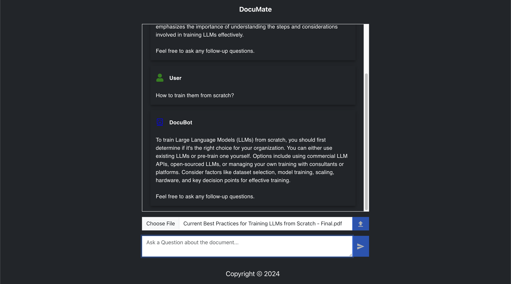

# DocuMate - A Document Analysis and Q&A Chatbot using RAG (Retrieval Augmented Generation)

The Document Q&A Chatbot is built using LangChain, OpenAI, Chroma DB, Flask, and React.



## Overview

Retrieval-Augmented Generation (RAG) is the process of optimizing the output of a large language model, so it references an authoritative knowledge base (ex. a PDF document in this case) outside of its training data sources before generating a response. Large Language Models (LLMs) are trained on vast volumes of data and use billions of parameters to generate original output for tasks like answering questions, translating languages, and completing sentences. RAG extends the already powerful capabilities of LLMs to specific domains or an organization's internal knowledge base, all without the need to retrain the model. It is a cost-effective approach to improving LLM output so it remains relevant, accurate, and useful in various contexts.

This project utilizes LangChain, OpenAI, Chroma DB, Flask, and React to provide a seamless Q&A Chatbot as a web app for users to chat with a PDF document. With RAG, you can easily upload any PDF document, generate vector embeddings for any knowledge based document, and perform contextualized conversations and relevant knowledge retrieval.


## Packages

- **LangChain**: A framework to build a RAG system and integrate the LLMs into the application.
- **OpenAI**: To use an OpenAI LLM using its API key.
- **Chroma DB**: A vector database to store PDF Document embeddings.
- **Flask**: A lightweight, open-source Python web framework.
- **React**: A JS library to build a SPA (Single Page App) and in this case UI of the Document Q&A Chatbot.


## Prerequisites

Before running the project, make sure you have created an OpenAI account and saved the OpenAI API Key as an environment variable in your system - more on this [here](https://platform.openai.com/docs/quickstart/step-2-setup-your-api-key)

- Python 3.10
- LangChain
- Chroma DB
- Flask
- React
- An OpenAI API key
- PDF document to upload

## Usage

1. Clone the repository to your local machine:

   ```bash
   git clone https://github.com/palaanudeep/documate.git
   cd documate
   ```

2. Installing and running Flask as a backend service:
   ```bash
   cd backend
   python -m venv venv # to create a virtual environment to install packages
   source venv/bin/activate # to activate the environment
   pip install -r requirements.txt
   flask run
   ```

3. Installing and running React for UI in a new terminal in documate folder:
   ```bash
   cd frontend
   npm install
   npm start
   ```

4. Access the app by opening a web browser and navigating to the URL (http://localhost:3000/).

5. Upload the PDF document you want to analyze.

6. Click the Upload button to process the document.

7. Chat with the DocuBot by asking any stand-alone or follow-up questions related to the document uploaded.

## Contributors

[Anudeep Pala](https://github.com/palaanudeep)

## Contact

If you have any questions, suggestions, or would like to discuss this project further, feel free to get in touch with me:

- [Email](mailto:anudeep.pala@gmail.com)
- [LinkedIn](https://www.linkedin.com/in/anudeeppala/)

I'm open to collaboration and would be happy to connect!