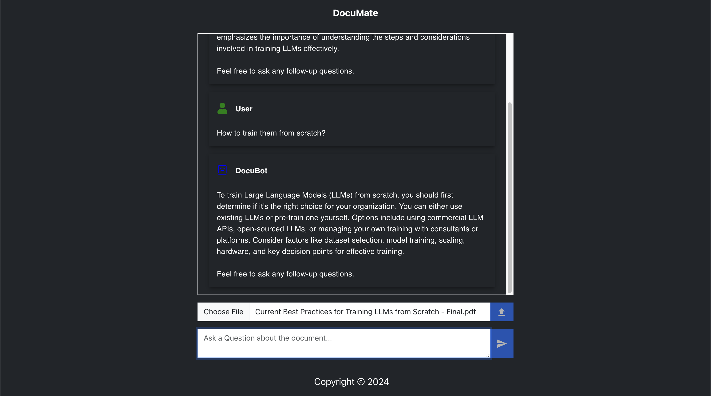

# DocuMate

Ask questions about PDFs and web pages. Get answers with citations showing exactly where the information came from.

**What it does:** Upload a PDF or paste a URL. Ask questions. DocuMate retrieves relevant sections, generates an answer, and cites the source (page numbers for PDFs, clickable links for web pages).



## Features

- **PDF and website Q&A**: Upload documents or paste URLs, ask questions in natural language
- **Citations**: Every answer shows which page (PDF) or which URL (web) it came from
- **Source snippets**: See the first 200 characters of each retrieved chunk
- **Chat history**: Follow-up questions understand previous conversation context
- **User accounts**: JWT-based auth, PostgreSQL storage for chats and messages
- **Streaming**: Token-by-token response generation
- **Structured logs**: JSON traces with request IDs, token counts, latency

## How It Works

```
┌─────────────┐
│   React     │  Upload PDF or paste URL
│  Frontend   │
└──────┬──────┘
       │ HTTP/REST
       ↓
┌──────────────────────────────────────────────┐
│          Flask Backend (JWT auth)            │
├──────────────────────────────────────────────┤
│  PDF: PyMuPDF → page metadata               │
│  URL: requests + BeautifulSoup              │
│       → fetch with timeout/limits           │
│  Chunking: 1000/200 recursive               │
│  Embed: text-embedding-3-small              │
│  Store: Chroma vector DB                    │
│  Retrieve: k=4 chunks                       │
│  Generate: gpt-3.5-turbo + context          │
│  Citations: page# (PDF) or URL              │
└──────────────────────────────────────────────┘
       │
       ↓
┌──────────────┐
│  PostgreSQL  │  Users, chats, messages
└──────────────┘
```

## Stack

- LangChain, OpenAI GPT-3.5-turbo, text-embedding-3-small
- Chroma vector store
- PyMuPDF (PDF parsing), BeautifulSoup + html2text (web pages)
- Flask + JWT auth, PostgreSQL, React 18

## Quick Start

### Prerequisites

- Python 3.10+, Node.js 18+, PostgreSQL 15+
- OpenAI API key ([get one here](https://platform.openai.com/api-keys))

### Docker Compose (Recommended)

```bash
git clone https://github.com/palaanudeep/documate.git
cd documate

cp .env.example .env
# Edit .env: add your OpenAI API key and secrets

docker-compose up

# Frontend: http://localhost:3000
# Backend: http://localhost:5000
```

### Local Development

```bash
# Backend
cd backend
python -m venv venv
source venv/bin/activate
pip install -r requirements.txt

cp .flaskenv.example .flaskenv
# Edit .flaskenv with your credentials

flask run

# Frontend (new terminal)
cd frontend
npm install
npm start

# Visit http://localhost:3000
```

## Usage

1. **Sign up** at http://localhost:3000
2. **Upload a PDF** or **paste a website URL**
3. **Ask questions** - the system retrieves relevant sections and answers
4. **Check citations** - each answer shows source pages or URLs

## API

All endpoints require JWT auth (`Authorization: Bearer <token>`):

| Endpoint | Method | Description |
|----------|--------|-------------|
| `/api/load_doc` | POST | Upload PDF or submit URL, get summary |
| `/api/get_answer` | POST | Ask question, get answer + citations |
| `/api/get_answer_stream` | POST | Stream answer with citations |
| `/auth/register` | POST | Create user account |
| `/auth/login` | POST | Get JWT token |

**Upload PDF:**
```bash
curl -X POST http://localhost:5000/api/load_doc \
  -H "Authorization: Bearer $TOKEN" \
  -F "file=@document.pdf"
```

**Submit URL:**
```bash
curl -X POST http://localhost:5000/api/load_doc \
  -H "Authorization: Bearer $TOKEN" \
  -H "Content-Type: application/json" \
  -d '{"url": "https://example.com/article"}'
```

**Response:**
```json
{
  "summary": "The document discusses...",
  "citations": [
    {
      "source_type": "pdf",
      "page": 0,
      "chunk_id": 3,
      "text": "The company was founded in 2018...",
      "source": "document.pdf"
    }
  ],
  "chat_id": 123,
  "request_id": "550e8400-e29b-41d4-a716-446655440000",
  "latency_ms": 1234,
  "token_usage": {
    "prompt_tokens": 850,
    "completion_tokens": 120,
    "total_tokens": 970
  }
}
```

**Citation formats:**

PDF citations include page numbers:
```json
{
  "source_type": "pdf",
  "page": 0,
  "chunk_id": 3,
  "text": "...",
  "source": "document.pdf"
}
```

URL citations include clickable links:
```json
{
  "source_type": "url",
  "url": "https://example.com/about",
  "title": "About Us",
  "chunk_id": 5,
  "text": "...",
  "source": "https://example.com/about"
}
```

## Configuration

### URL Fetching

- Timeout: 30 seconds
- Max page size: 10MB
- Supported: http/https only
- Extracts main content, removes nav/footer/scripts
- No link following or crawling

### Chunking & Retrieval

```python
chunk_size=1000          # Characters per chunk
chunk_overlap=200        # Overlap for context
k=4                      # Chunks retrieved per query
embedding="text-embedding-3-small"
separators=["\n\n", "\n", " ", ""]  # Prefer paragraph boundaries
```

### Logging

Every request generates a JSON log:
```json
{
  "request_id": "...",
  "timestamp": 1704067200.0,
  "question": "What is the company revenue?",
  "answer": "...",
  "citations": [...],
  "token_usage": {"prompt_tokens": 850, "completion_tokens": 120, "total_tokens": 970},
  "latency_ms": 1234,
  "retrieval_count": 4,
  "model": "gpt-3.5-turbo-0125"
}
```

Token counts are estimates (word count × 1.3). For exact counts, parse OpenAI API response usage fields.

Optional LangSmith integration: set `LANGCHAIN_TRACING_V2=true` in `.env`.

## Evaluation

The `evals/` directory includes a test harness with PDF and HTML fixtures:

```bash
make eval

# Or manually:
cd evals
python3 create_fixture_pdf.py  # Generates test_document.pdf
python3 run_evals.py            # Runs 15 test questions

# Output: eval_results.json
```

**Metrics:**
- Retrieval hit rate: % of queries where expected evidence appears in chunks
- Groundedness: % of answers containing retrieved context
- Latency and token usage per query

Note: Numbers are not pre-run. `make eval` requires an OpenAI API key to generate actual metrics.

## Limitations

**Current constraints:**
- **Single document per session**: Each upload replaces the in-memory vector store
- **Ephemeral embeddings**: Lost on restart (Chroma in-memory)
- **Token estimates**: Word count × 1.3, not parsed from API responses
- **No re-ranking**: Uses basic vector similarity only
- **No multi-doc search**: Can't query across multiple PDFs/URLs at once

**URL fetching limits:**
- 30-second timeout
- 10MB max page size
- Main content only (no nav, ads, footers)
- Single GET request, no crawling

## Cost & Latency

Estimated per typical document (3 pages, ~1200 tokens):

- Embedding: ~$0.0001 per document (one-time)
- Query: ~$0.002 per Q&A (4 chunks × 250 tokens + generation)
- Latency: ~1-2s per query

## Development

```bash
# Run evals
make eval

# Clean artifacts
make clean

# Backend tests
cd backend
pytest

# Lint/format
flake8 app/
black app/
```

## Project Structure

```
documate/
├── backend/
│   ├── app/
│   │   ├── __init__.py
│   │   ├── models.py
│   │   ├── auth/routes.py
│   │   └── main/
│   │       ├── routes.py
│   │       ├── llm/document_rag.py
│   │       └── utils.py
│   ├── requirements.txt
│   └── Dockerfile
├── frontend/
│   ├── src/components/chat.js
│   ├── package.json
│   └── Dockerfile
├── evals/
│   ├── fixtures/
│   ├── test_cases.py
│   ├── run_evals.py
│   └── test_url_ingest.py
├── docker-compose.yml
├── Makefile
└── README.md
```

## Future Work

Not implemented yet:

- Persistent vector store (Chroma → disk or Pinecone/Weaviate)
- Multi-document retrieval across sources
- Hybrid search (BM25 + vector)
- Re-ranking with cross-encoder
- Actual token counting from OpenAI API responses
- Query expansion and confidence scoring

## Contact

Questions or suggestions: [anudeep.pala@gmail.com](mailto:anudeep.pala@gmail.com)

## License

MIT
